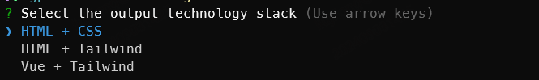

## Introduction

- `aimg2code` is a simple and easy-to-use tool for generating code from images, which takes advantage of the ability of multimodal large models to recognize text and images.
- You can customize the model, but you need to pay attention to the following capabilities of the model you use:
  - Compatible with OpenAI interface
  - Support image recognition
- Technology stack that supports code generation
  - `HTML + CSS`
  - `HTML + Tailwind`

## Installation

> Environment requirements: node>=18

- You can install it globally and then use `aimg2code` in any directory **[Recommended]**.
```bash
npm i aimg2code -g
```
- You can also download the npm package to your current working directory.
```bash
npm i aimg2code
```
- Or you can use [npx](https://docs.npmjs.com/cli/v8/commands/npx) to use `aimg2code`, avoiding downloading the npm package locally.
```bash
npx aimg2code
```

## Usage

#### After installing `aimg2code`, you can use it in project scripts or command lines.
- Add a new command in `scripts` of `package.json`
```json
"scripts": {
"aimg2code": "aimg2code -i ./image.png"
}
```
- Or execute the script directly in the command line. You do not need to create a new `package.json` in the current working directory. The directory only contains the configuration file.
```bash
npx aimg2code -i ./image.png
```
Global command usage
```bash
aimg2code -i https:/xx.png
```

**Command line parameter introduction:**
- `-i`: The image to be converted. The value is a string of the relative path or URL of the image. Supports parsing local and remote images (http/https); supports passing in multiple images, separated by `,`, such as "./img1.png,./img2.png".

**Configuration file introduction:**
> *`aimg2code.config.json`* must exist in the current working directory where `aimg2code` is used. `aimg2code` will read the configuration file to complete the task.

**`aimg2code.config.json`** has the following fields:

| Name | Optional | Description | Support CLI parameters |
| :------------ | :------- | :---------------------------------------------------- | :--- |
| openaiApiKey | ❌ | The API-KEY of the model you use, required | - |
| openaiModel | ✅ | The model name of the model you use, such as `gpt-4o`. Default value: `gpt-4o` | - |
| openaiBaseUrl | ✅ | The network access address of the model you use, such as `https://api.openai.com/v1`. Default value: `https://api.openai.com/v1` | - |
| images | ✅ | An array of string of relative paths or URLs of images to be converted into code. Multiple images can be passed in, for example `['img1.png', 'img2.png']` | -i, if this parameter is in the command line script, this configuration will be ignored |

**Configuration file example:**

- This is an `aimg2code.config.json` file that covers all configurations. The model uses the `qwen-vl-max` of the [Tongyi Qianwen](https://help.aliyun.com/zh/dashscope/developer-reference/compatibility-of-openai-with-dashscope?spm=a2c4g.11186623.0.0.5c5e5b789qrYDP) series:
```json
// aimg2code.config.json
{
"openaiApiKey": "API-KEY you applied for",
"openaiModel": "qwen-vl-max",
"openaiBaseUrl": "https://dashscope.aliyuncs.com/compatible-mode/v1",
"images": ["./image.png"]
}
```
- Minimum configuration, using the default model `gpt-4o`
```json
// aimg2code.config.json
{
"openaiApiKey": "The API-KEY of GPT you applied for"
}
```

**Output file:**



Select the technology stack you want to generate code. After `aimg2code` is successfully called, the converted HTML file will be output in the current working directory. The file name format is: output_current-time.html

#### Best Practices
- For the same or the same group of images, you can call `aimg2code` multiple times to select the best or most appropriate result.
- When multiple images are passed in, the first image is recommended to contain the overall content structure, and the second or multiple images are recommended to be more detailed supplements to the first image, such as partial close-ups.
- When the generated code is inaccurate for images with a lot of content, the images can be cut according to the content structure and passed in, and only a certain piece of content can be converted each time, which can improve the accuracy.