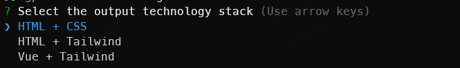

## 介绍

- `aimg2code` 是一款简单易用的图片生成代码的工具，利用了多模态大模型识别文本和图像的能力。
- 可以自定义模型，但需要注意你使用的模型需要支持以下能力:
  - 兼容 OpenAI 接口
  - 支持图像识别
- 支持生成代码的技术栈
  -  `HTML + CSS`
  -  `HTML + Tailwind`

## 安装

> 环境要求：node>=18

- 你可以全局安装, 然后在任意目录中使用`aimg2code` **【推荐】**。
```bash
npm i aimg2code -g
```
- 你也可以下载npm包到你的当前工作目录中。
```bash
npm i aimg2code
```
- 或者你可以使用 [npx](https://docs.npmjs.com/cli/v8/commands/npx) 来使用 `aimg2code`, 避免将npm包下载到本地。
```bash
npx aimg2code
```

## 使用

#### 在安装 `aimg2code` 后，你可以在项目脚本或者命令行中使用。
- 在 `package.json` 的 `scripts` 中新增指令
  ```json
  "scripts": {
    "aimg2code": "aimg2code -i ./image.png"
  }
  ```
- 或者直接在命令行中执行脚本，你不需要在当前工作目录中新建 `package.json`，目录中仅包含配置文件即可。
  ```bash
  npx aimg2code -i ./image.png
  ```
  全局命令使用
  ```bash
  aimg2code -i https:/xx.png
  ```

**命令行参数介绍：**
- `-i` : 需要转换的图片，值为图片相对路径或者URL的字符串。支持解析本地图片和远程图片(http/https)；支持传入多张图片,以`,`分隔，例如 "./img1.png,./img2.png"。


**配置文件介绍：**
> *在使用 `aimg2code` 的当前工作目录中必须存在 `aimg2code.config.json`* ，`aimg2code` 会读取配置文件完成任务。

**`aimg2code.config.json`** 有以下字段：

| Name          | Optional | Description                                                                                   | Support CLI parameters  |
| :------------ | :------- | :----------------------------------------------------                                         | :---       |
| openaiApiKey  | ❌      | 你使用的模型的API-KEY，必须                                                                      | -          |
| openaiModel   | ✅      | 你使用的模型的模型名，例如 `gpt-4o`。默认值：`gpt-4o`                                             | -          |
| openaiBaseUrl | ✅      | 你使用的模型的网络访问地址，例如 `https://api.openai.com/v1`。 默认值：`https://api.openai.com/v1`  | -          |
| images        | ✅      | 需要转换成代码的图片相对路径或URL的字符串数组，支持传入多张图片, 例如 `['img1.png', 'img2.png']`         | -i, 若命令行脚本中有此参数，则忽略该项配置  |

**配置文件示例：**

- 这是一个涵盖了全部配置的 `aimg2code.config.json` 文件，模型使用 [通义千问](https://help.aliyun.com/zh/dashscope/developer-reference/compatibility-of-openai-with-dashscope?spm=a2c4g.11186623.0.0.5c5e5b789qrYDP) 系列的 `qwen-vl-max`：
```json
// aimg2code.config.json
{
  "openaiApiKey": "你申请的API-KEY",
  "openaiModel": "qwen-vl-max",
  "openaiBaseUrl": "https://dashscope.aliyuncs.com/compatible-mode/v1",
  "images": ["./image.png"]
}
```
- 最小配置，使用默认模型`gpt-4o`
```json
// aimg2code.config.json
{
  "openaiApiKey": "你申请的GPT的API-KEY"
}
```

**输出文件：**



选择你要生成代码的技术栈，`aimg2code` 调用成功后，会在当前工作目录输出转换后的html文件，文件名格式为：output_当前时间.html


#### 最佳实践
- 对于同一张或者同一组图片，你可以多次调用 `aimg2code` 来选择最优或者最合适的结果。
- 传入多张图片时，第一张图片建议是包含了整体的内容结构，第二张或者多张图建议是对第一张图片更详细的补充，例如局部特写。
- 当传入内容较多的图片，生成代码不准确时，可以将图片根据内容结构切割后传入，每次只转换某一块内容的图片，可以提高准确率。
